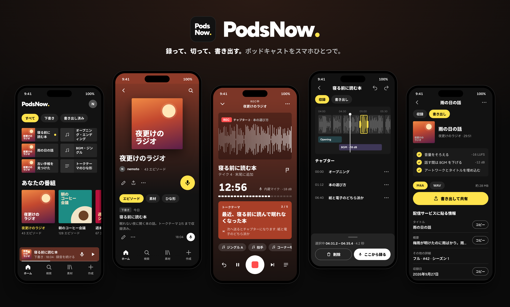
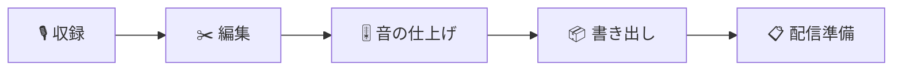

<p align="center">
  
</p>

<p align="center">
  <b>録って、切って、書き出す。ポッドキャストをスマホひとつで。</b><br>
  Record, cut and export your podcast — all on your phone.
</p>

<p align="center">
  
  
  
  
  
  
  
</p>

---

**PodsNow（ポッズナウ）** は、ポッドキャストの「収録 → 編集 → 音の仕上げ → 書き出し → 配信準備」を
スマートフォンだけで終わらせる、ローカルファーストの収録アプリです。アカウント登録なしで、録音も編集データも端末の中に置きます。

> [!NOTE]
> いまは **0.1.0（MVP）** を開発中です。開発者自身が自分の番組で使うドッグフーディング版で、ストアには出していません。
> 上の画像はデザインの見本（[`docs/design-refresh/ds4/mock.html`](docs/design-refresh/ds4/mock.html)）から描いたもので、実機の画面写真ではありません。

## できること



|  |  |
|---|---|
| 🎙️ **止まらない収録** | 画面ロック中も他のアプリを使っていても録り続けます。電話や強制終了があっても、それまでの録音は失いません。 |
| ✂️ **録る画面で、そのまま切る** | 無音で区切られた塊をタップして削除し、空いた位置からそのまま録り直し。無音の一括カット、チャプター、取り消し / やり直しも同じ画面で。 |
| 🧩 **定型作業はひな形に** | Opening / Ending / BGM / ジングルとトークテーマを番組に登録しておけば、新しい回を作るだけで並びます。ジングルは収録中にワンタップ。 |
| 🎚️ **音の仕上げ** | ラウドネスを -16 LUFS にそろえ、話している間は BGM を自動で下げます。試聴にもすぐ反映。 |
| 📦 **書き出しと配信準備** | M4A / WAV で書き出してアートワークとタイトルを埋め込み、タイトル・概要などを 1 項目ずつコピーして配信サービスへ貼るだけ。 |
| 🔒 **ローカルファースト** | 収録・編集・書き出しはオフラインで完結。通信するのは、配信中の番組の情報を取り込むときだけです。 |

## 設計の考え方

1. **録音データを失わない**（最優先）— 非圧縮 PCM・ヘッダの定期更新・復旧ジャーナル・非破壊編集
2. **工程はひとつのエピソードの中に** — 番組 → エピソード → 「収録 / 書き出し」の 2 タブだけ
3. **独自の言葉を作らない** — 画面に出すのは録音 / 編集 / 書き出し / 素材 / チャプターなどの一般語だけ
4. **色は番組から** — アプリの地は黒とグレー、色は番組のアートワークから取り、PodsNow の色は主操作の黄 1 色とロゴだけ

## ドキュメント

| 文書 | 内容 |
|---|---|
| [PRODUCT.md](PRODUCT.md) | 何を作るか、版ごとのスコープ |
| [REQUIREMENTS.md](REQUIREMENTS.md) | 要件（FR-xx / NFR-x） |
| [ARCHITECTURE.md](ARCHITECTURE.md) | レイヤー構成、JS / ネイティブの境界 |
| [DATA_MODEL.md](DATA_MODEL.md) | SQLite スキーマ、タイムラインの不変条件 |
| [AUDIO_DESIGN.md](AUDIO_DESIGN.md) | 録音・割り込み・レンダリング |
| [DESIGN_SYSTEM.md](DESIGN_SYSTEM.md) | デザイントークン、色の作り方、コントラストの基準 |
| [DEVELOPMENT.md](DEVELOPMENT.md) | ブランチ戦略、規約、テスト、フェーズ計画 |

## 開発

Expo SDK 57 / React Native 0.86 / TypeScript。Expo Go ではなく Development Build で動かします。
録音と音声処理は `modules/` の自作ネイティブモジュールです。

```sh
npm install
npm run ios      # または npm run android（Development Build）
npm run lint && npm run typecheck && npm test
```

README の画像は `python3 scripts/readme/generate.py` で見本から描き直せます（Google Chrome が必要）。

---

<sub>表記は **PodsNow（ポッズナウ）**。リポジトリ名・`slug`・bundle id などの識別子は小文字の `podsnow` です。</sub>
