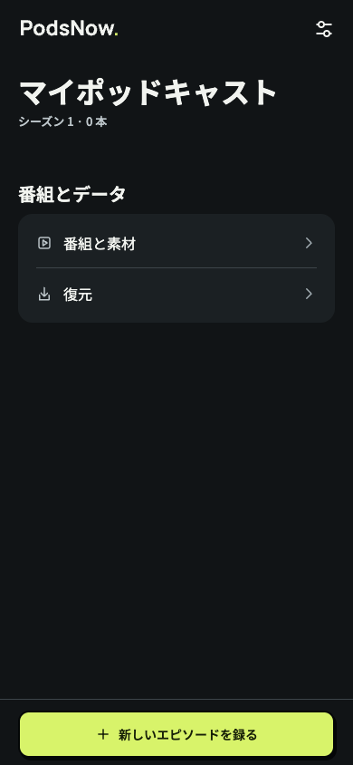
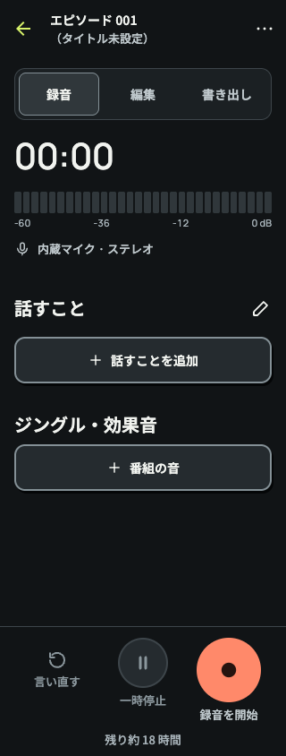

# ダークの操作感と数字の書体（Issue #110）

## 調査と判断

【事実】従来の数値表示は IBM Plex Mono Regular。中央に点を持つゼロがあり、タイマー・時間・容量・目盛りに使用していた。「AIらしい」は印象であり、書体の客観的な分類ではない。

【確認済み】IBM は Plex Mono を開発環境でのコード用途に位置付けている。PodsNow の録音・編集の表示に採用する必然性はない。
出典: [IBM Design Language](https://www.ibm.com/design/language/typography/typeface/)

【確認済み】Google の Ken Frederick、Tobias Kunisch と Colophon の書体開発では、ロゴから製品までの連続性に加え、小さな UI での判読性・字間など、利用場面への適応を重視している。
出典: [Google Sans Flex](https://design.google/library/google-sans-flex-font)

【確認済み】Matthew Butterick は、書体の組み合わせ自体を目的にせず、少数の書体と一貫した役割を勧めている。Ilene Strizver は、列や数値の整列には等幅数字、通常の文章にはプロポーショナル数字を使い分けると説明する。
出典: [Practical Typography](https://practicaltypography.com/mixing-fonts.html)、[The Type Studio / Fonts.com](https://www.myfonts.com/pages/fontscom-learning-fontology-level-3-numbers-proportional-vs-tabular-figures)

【仮説】PodsNow では「技術的な計器」を強調する別書体を増やすより、録音時間をロゴと同系統の Manrope に揃える方が、サービス固有のまとまりを作れる。ダークのシトロンと暗い背景は維持し、操作部の物理的な輪郭でネオブルータリズムを強める。

## 落とし込み

【事実】ロゴの輪郭・字間・寸法は変更していない。日本語 UI は Noto Sans JP、英語 UI は Manrope のまま。数字専用の役割を `numeric` に改め、Manrope 500 と `tabular-nums` を組み合わせた。本文中の数字を個別に分割することはしない。

【事実】同梱 Manrope の 4 ウェイトには `tnum` があり、置換後の 0〜9 は各 1240 units。通常・等幅のゼロはいずれも外周と内周の2輪郭で、中央の点がない。`scripts/fonts/verify.py` で検証できる（fontTools が必要）。未登録時は言語に応じた本文書体、さらに OS 書体へ退避する。IBM Plex Mono の埋め込み設定と不要なアセットを削除した。

【確認済み】React Native の `fontVariant` は `tabular-nums` を提供する。フォントの埋め込み設定変更にはネイティブ再ビルドが必要。
出典: [React Native 0.86](https://reactnative.dev/docs/0.86/text-style-props#fontvariant)、[Expo Font SDK 57](https://docs.expo.dev/versions/v57.0.0/sdk/font/)

【事実】ダークの主操作は2pxの濃い枠と硬い影、副操作は `surfaceRaised` の面と2pxの枠。ライトと同じ寸法・押下時2pxの移動を使う。押下時の影は短くし、モーション抑制では移動しない。無効状態は影なし。Android 7/8 は既存の対応分岐により輪郭のみ。

## 検証

【事実】lint・型チェック・Jest 29スイート298件・format check が成功。色生成の258組のコントラスト検査、Manrope実ファイルの数字幅とゼロ字形の検査も成功。

【事実】Webのシミュレーターで日英・幅320/390を確認。ホーム・設定・番組画面でページエラーとページ全体の横溢れなし。ボタンの通常時は2px枠、影は右2px/下3px。押下時は下2px移動し、影は右0px/下1px。モーション抑制では移動なし。これはネイティブ実機の検証ではない。

【事実】収録タイマーの計算スタイルは Manrope 500 / tabular-nums。幅320のブラウザー上で `00:00`・`11:11`・`88:88` は111.75px、`01:00:00`・`11:11:11` は173.890625pxで一致した。

【仮説・未検証】iOS/Android のネイティブ再ビルド後、点のないゼロ・数字の等幅・日英の実ウェイト・文字拡大・ダークの影・無効状態を確認する。実機確認は #104 で追跡する。

