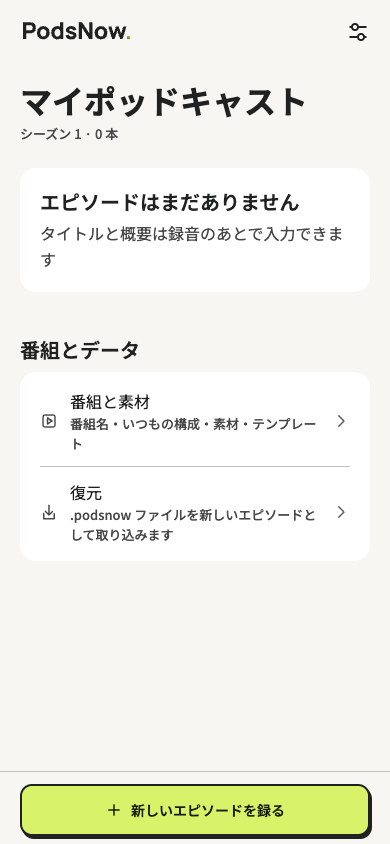
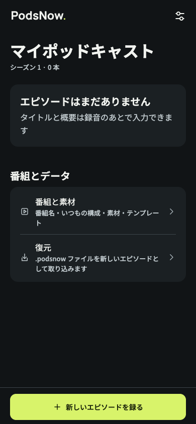

# ライトテーマのネオブルータリズム（Issue #105）

【事実】2026-09-24。温かい白、ニュートラルな文字・操作境界、ブランド専用のライム色を導入。
共通 Button の主操作・副操作はライトで 2px の枠と短い硬い影を持つ。両テーマで 2px の押し込みを共有。
ダークの既存57色はすべて変更前と一致する。録音や破壊の意味色は維持し、ライトの文字色は新しい面から再計算した。

## 検証【事実】

- lint / typecheck / Jest（29 suites、296 tests）/ format:check 成功。
- 色生成: 256組のコントラストを検証。ロゴの点は bg / surface 上で製品基準3:1以上。
- iOS JavaScript/Hermesバンドル生成（expo export --platform ios）: 成功。ネイティブビルド・実機確認ではない。
- ブランド生成: 成功。ライトの横組みSVGとスプラッシュを再生成。
- Web描画: 一時コピーに scripts/web-preview のDB・ファイル・録音シムを適用し、Expo Web export とChromeで確認。
  プロジェクトの依存は変更していない。これはネイティブの音声処理や実機描画の検証ではない。
- 日本語: ライト／ダーク、幅320／390のホーム・設定・番組画面。横はみ出し・pageerrorなし。
- 英語: 幅320の録音／書き出し画面。横はみ出し・pageerrorなし。
- ライト主ボタン: 通常の影2px/3px、押下の影0px/1px、移動2pxをブラウザの算出スタイルで確認。
- ダーク主ボタン: 影なし・枠1pxを維持し、移動2pxを確認。
- OSの動きを減らす: 押下中も移動0・影固定。無効な再生／保存／書き出しボタンは影なし・移動0。

## 画面【事実】

画像は実装した画面のWeb描画。iOS/Androidのスクリーンショットではない。

| ライト | ダーク |
|---|---|
|  |  |

[ライトの押下状態](light-390-pressed.png)、[幅320](light-320-home.png)、[入力欄](light-390-show.png)。

## 実機での確認【仮説・未検証】

#104 で追跡する。ネイティブを再生成・再ビルドしたリリースビルドで以下を確認する。

- 両テーマ・日英・最大文字サイズで、ボタンのラベルや影が欠けず隣の操作を覆わない。
- 押下・指を外す・処理中・無効の見え方と、動きを減らす設定。
- Android 9以降とiOSの硬い影。Android 7/8では影を省き輪郭で示す。
- 屋外のライトの点・入力欄、暗所のダークの操作部。
- OSテーマ別スプラッシュの背景と新しいライトの点。アプリ内テーマとの独立性。

【確認済み】boxShadowのAndroid対応範囲: https://reactnative.dev/docs/0.86/view-style-props#boxshadow
