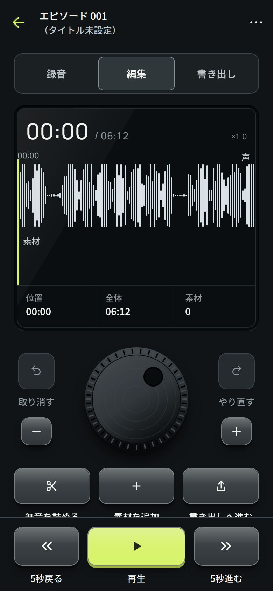
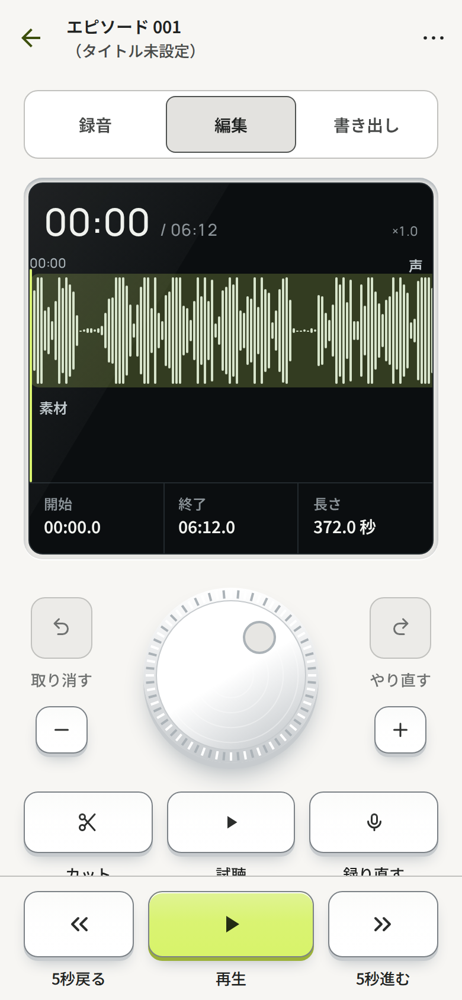
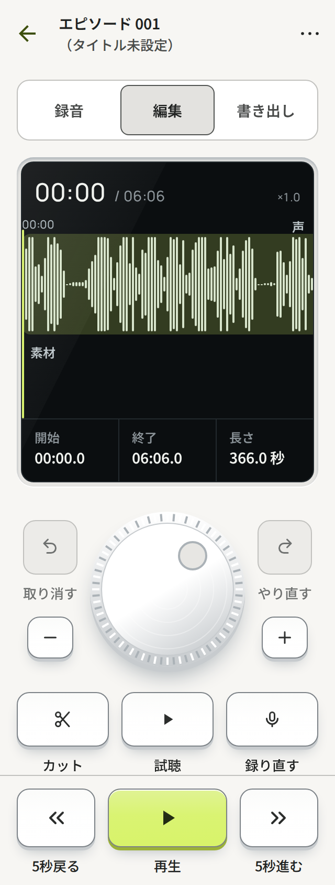

# PN-01：編集タブだけの録音機の表現（Issue #115）

【事実】2026-09-25。方向性の検討は `../direction-exploration/`（比較 `index.html`、スタディ `pn-01.html`）。
規則は DESIGN_SYSTEM.md §6.3。

## 経緯【事実】

1. スタディで「用の美」の録音機（PN-01）の方向に決め、録音タブ・Home・書き出しを含むアプリ全体に広げて実装した。
2. レビューで方針を変え、**録音機の表現は編集タブだけに使う**ことにした。ほかの画面（Home、録音タブ、書き出しタブ、
   設定、番組と素材、復元、配信の準備、バックアップ）は、従来のデザインシステムとデザイン思想のまま残す。
3. そのため、全体に広げた変更（面の色、Button のキー化、録音タブ・Home・書き出しの作り直し、スプラッシュの色）は
   `release/0.1.0` の状態に戻した。**既存トークンの値は 1 つも変えていない**（追加だけ）。

## 編集タブで変えたもの【事実】

| 範囲 | 内容 |
|---|---|
| トークン | `key*` / `keyEdge` / `well` / `seam*` / `disp*` を追加。`generate.py` で 307 組のコントラストを検証 |
| 部品 | `src/ui/device.tsx`（`Display` / `DisplayCells` / `Key` / `Led` / `Sheen`）。`ThemeContext` の `DarkInside` |
| 編集タブ | 再生位置・波形・選択の数値を 1 枚の表示窓に。取り消し・やり直し・拡大縮小のキー、ジョグダイヤル、道具のキー |
| ジョグダイヤル | `src/features/episode/JogWheel.tsx`。1 回転 = 10 秒、30° ごとに触覚、読み上げでは増減 |
| 操作バー | 編集タブのときだけ、5 秒戻る・再生（シトロン）・5 秒進むをキーに |

## 検証【事実】

- lint / typecheck / Jest（310 tests）/ format:check 成功。
- Web 描画: `scripts/web-preview` の手順で Expo Web export を Chromium で撮影。ライト / ダーク、幅 390 / 320、日本語。
  `pageerror` なし。録音タブと書き出しタブが従来のデザインのままであることも確認した。
  ネイティブの描画・触覚・ジョグの操作感の検証ではない。

| 編集（ダーク） | 編集・選択中（ライト） | 幅 320 |
|---|---|---|
|  |  |  |

ほか: [編集・選択中（ダーク）](dark-390-05c-edit-selection.png)、[編集（ライト）](light-390-05b-edit.png)、
従来のままの画面として [録音タブ](light-390-03-recording.png)、[書き出しタブ](dark-390-06-export.png)。

## 実機での確認【仮説・未検証】

- iOS / Android でキーの `boxShadow`（`inset` の光・`spreadDistance` の影）と SVG の光沢が崩れずに描けるか。
  Android 7/8 は影なしで輪郭だけになる。
- ジョグダイヤルの回しやすさ、1 回転 10 秒の速さ、30° ごとの触覚の強さ。VoiceOver / TalkBack での増減。
- 最大文字サイズで表示窓のセルとキーの名前が崩れないか。
