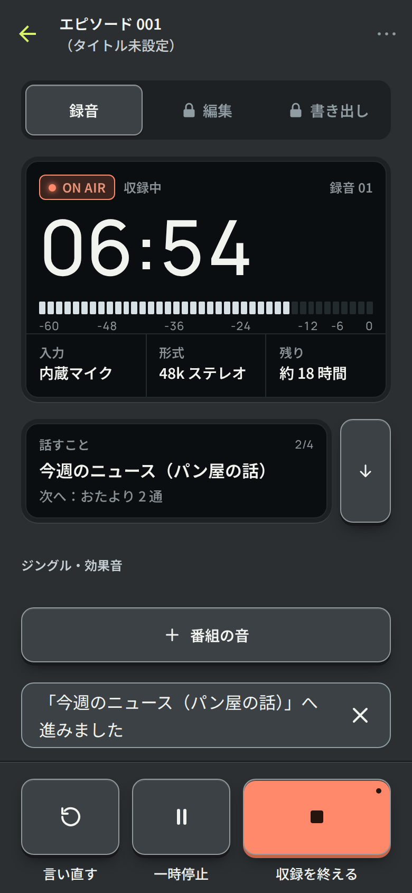
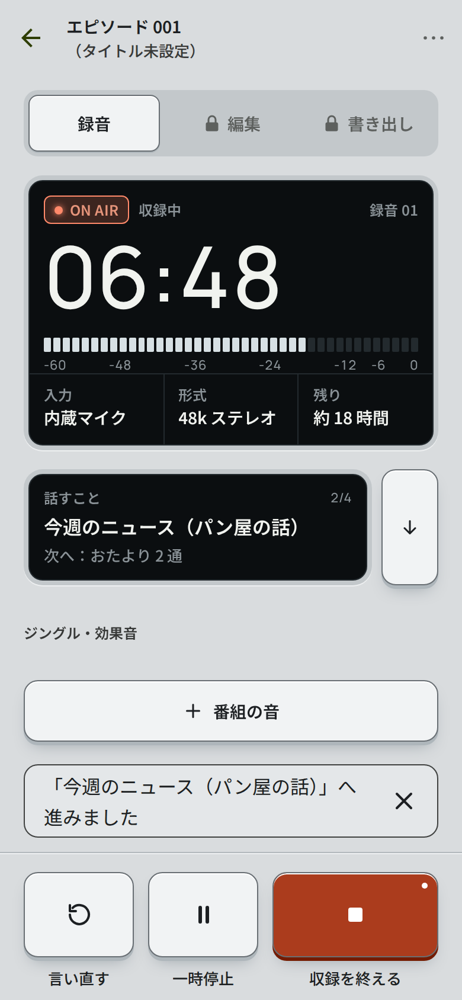
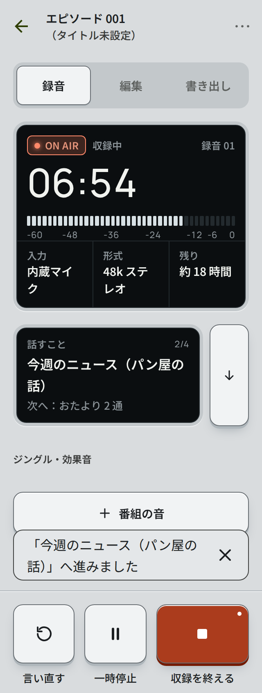
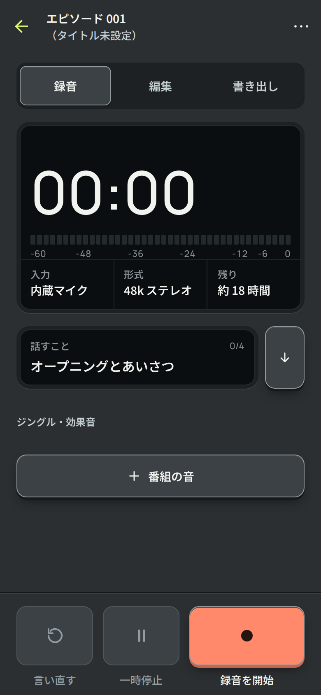
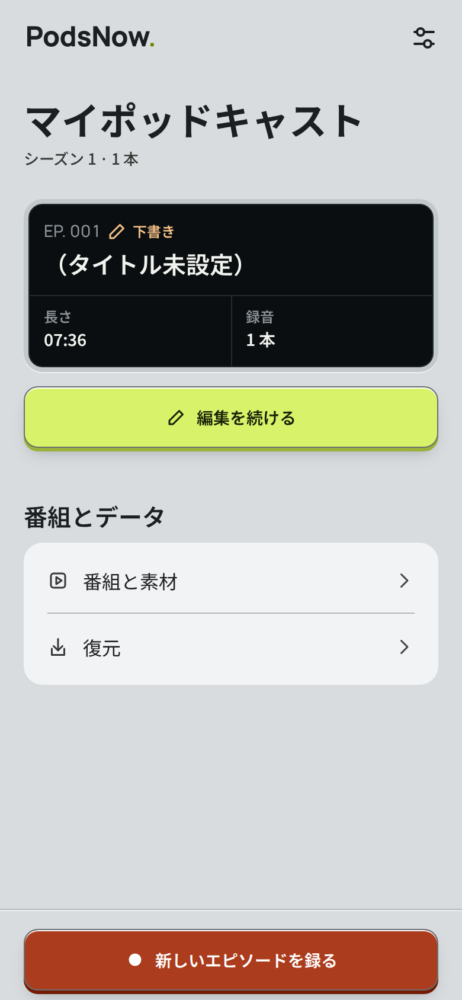
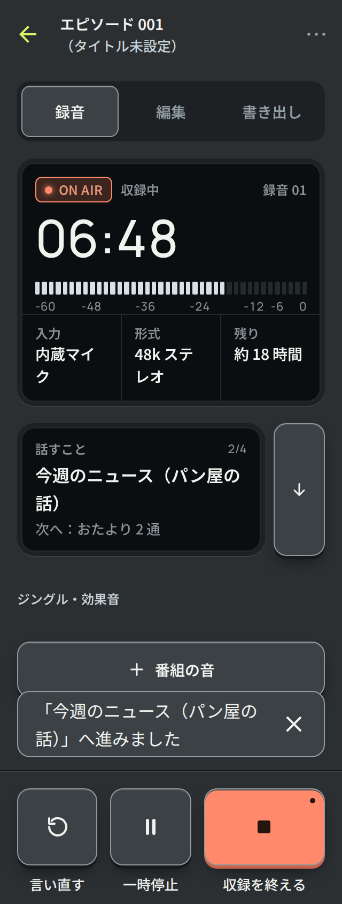

# PN-01 の実装（Issue #115、第 1 段）

【事実】2026-09-25 実装。方向性の検討は `../direction-exploration/`（比較 `index.html`、スタディ `pn-01.html`）。

質感は 3 つだけにした。**面**（ライトはシルバー、ダークはグラファイト）、**表示窓**（テーマに関係なく黒いガラス）、
**キー**（天面・側面・柔らかい影）。見るものは表示窓に、触るものはキーに置く。規則は DESIGN_SYSTEM.md §2・§5.1・§6。

## 変えたもの【事実】

| 範囲 | 内容 |
|---|---|
| トークン | `bg` などの面を置き換え、`well`・`key*`・`seam*`・`disp*` を追加。`controlEdge` / `controlBorder` / `controlShadow` を削除。`generate.py` で 340 組のコントラストを検証 |
| 部品 | `src/ui/device.tsx`（`Display` / `DisplayCells` / `Key` / `Led` / `Seam` / `PanelLabel`）。`Button` を キーの描画に置き換え、`kind="rec"` を追加。`Segmented` は溝の中で選ばれた駒が浮く形に |
| 録音タブ | 状態・ON AIR・テイク・時間・レベル・入力・形式・残りを 1 枚の表示窓に。話すことは表示窓と「次へ」のキー。ジングル・効果音はパッド |
| Transport | 録音・編集の操作をキーに。残り容量は表示窓へ移し、操作バーには保存停止の警告だけを残す |
| Home | 制作中の回を表示窓で表示。「新しいエピソードを録る」は録音のキー |
| スプラッシュ | 背景をライト `#D9DCDE` / ダーク `#2B2F32` に。ライトのロゴの点は新しい面に対して 3:1 を保つ色に再生成 |

## 範囲外（後続の Issue）

- 編集タブの波形を表示窓に入れる、ジョグダイヤル
- 書き出しタブの表示窓（進み具合・形式・音量）
- 面の着せ替え（イエローなど）、アプリアイコンの差し替え
- レベルメーターのピーク保持

## 検証【事実】

- lint / typecheck / Jest / format:check 成功。
- 色生成: 340 組のコントラストが基準を満たす。表示窓の色がテーマで変わらないことをテストで確認。
- Web 描画: `scripts/web-preview` の手順で Expo Web export を Chromium で撮影。ライト / ダーク、幅 390 / 320、日本語。
  `pageerror` なし。ネイティブの録音・実機描画の検証ではない。
- 英語表示と最大文字サイズは未撮影。

| ダーク 390 | ライト 390 | 幅 320 |
|---|---|---|
|  |  |  |
|  |  |  |

ほか: [一時停止](dark-390-04-paused.png)、[Home（空）](dark-390-01-home.png)、[Home（ダーク）](dark-390-07-home-data.png)、
[書き出し](light-390-06-export.png)、[設定](light-390-08-settings.png)。

## 実機での確認【仮説・未検証】

- iOS / Android でキーの `boxShadow`（`inset` の光・`spreadDistance` の影）が崩れずに描けるか。Android 7/8 は影なしで輪郭だけになる。
- 押し込み（2px）と触覚の組み合わせ、動きを減らす設定での見え方。
- 屋外でのシルバーの面と表示窓の見え方、暗所でのグラファイトの面と ON AIR。
- 最大文字サイズで表示窓の時間・セルが崩れないか。
